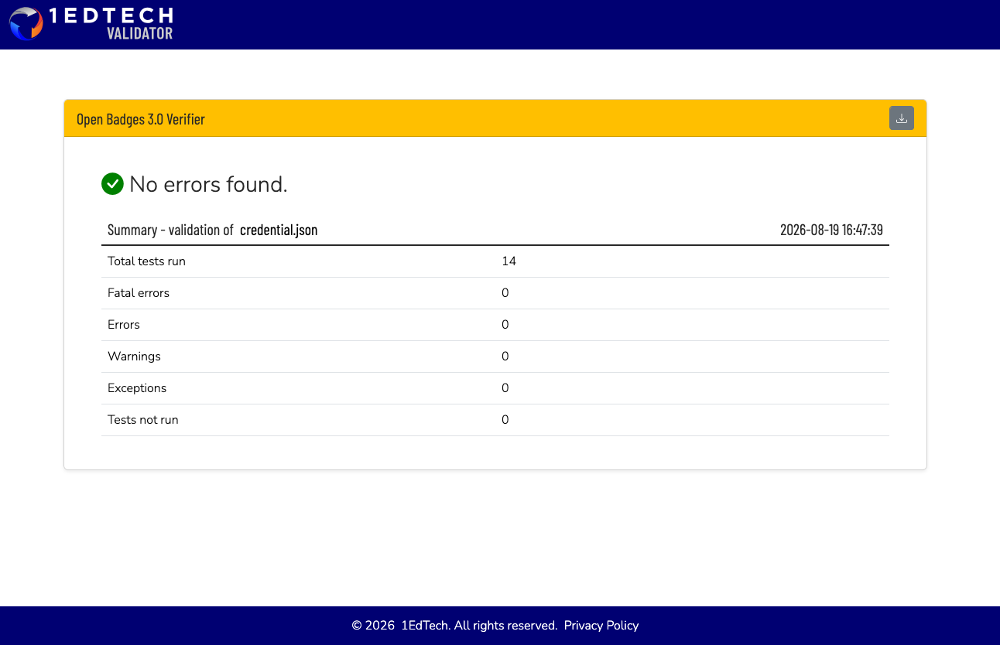

# OB 3.0 did:web validator spike — report and exit-criterion decision

Date: 2026-08-19
Scope: rollout step 1 (Task 3) de-risking spike required by spec §D3 —
"the did:web support of the public validator is an unknown that must not be
discovered at the end of the project."

## Verdict (one line)

**PASS — `did:web` confirmed by vc.1ed.tech.** did:web resolution, key
derivation, and the `eddsa-rdfc-2022` DataIntegrityProof signature all
verified successfully against a throwaway credential served from a
disposable public tunnel. **Exit-criterion decision: keep `did:web` as the
primary issuer-identity mechanism for rollout step 3 (signature + routes) —
no fallback to a bare HTTPS key URL is needed.**

## Protocol, step by step

1. **gen-dev-key.sh** (new script, `badgekit-stack/gen-dev-key.sh`) wraps
   `docker compose run --rm --no-deps api node bin/generate-issuer-key.js
   "$1"` and writes/replaces `ISSUER_DID` / `ISSUER_SIGNING_KEY` in a
   gitignored `.env` in this directory. `compose.yaml`'s `api` service now
   passes both through: `ISSUER_DID: ${ISSUER_DID:-}` /
   `ISSUER_SIGNING_KEY: ${ISSUER_SIGNING_KEY:-}`.

2. **Rebuild + local smoke.** Rebuilt the `api` image from the local
   `badgekit-api` checkout (branch `ob3-step-1`, head `d6da79c`):
   `docker compose build api`. Ran `./gen-dev-key.sh` (default
   `did:web:localhost%3A8080`), then `docker compose up -d --build api`.

   ```
   $ curl -s -w "\nHTTP %{http_code}\n" http://localhost:8080/.well-known/did.json
   {"@context":["https://www.w3.org/ns/did/v1","https://w3id.org/security/multikey/v1"],
    "id":"did:web:localhost%3A8080", ...}
   HTTP 200
   ```

3. **Disposable public tunnel.** Installed `cloudflared` via Homebrew
   (absent beforehand). Ran, backgrounded, log to file:

   ```
   cloudflared tunnel --url http://localhost:8080
   ```

   Tunnel hostname obtained from the log:
   **`https://systematic-magnitude-duke-ohio.trycloudflare.com`**
   (ephemeral, torn down at the end of this spike — see "Cleanup" below).

4. **Throwaway key for the tunnel domain.** Regenerated the issuer key
   scoped to the tunnel host:

   ```
   ./gen-dev-key.sh 'did:web:systematic-magnitude-duke-ohio.trycloudflare.com'
   docker compose up -d api
   ```

   Verified `did.json` resolves both from inside the host and **through the
   public tunnel**:

   ```
   $ curl -s -w "\nHTTP %{http_code}\n" https://systematic-magnitude-duke-ohio.trycloudflare.com/.well-known/did.json
   {"@context":["https://www.w3.org/ns/did/v1","https://w3id.org/security/multikey/v1"],
    "id":"did:web:systematic-magnitude-duke-ohio.trycloudflare.com",
    "verificationMethod":[{"id":"did:web:systematic-magnitude-duke-ohio.trycloudflare.com#key-0",
    "type":"Multikey","controller":"did:web:systematic-magnitude-duke-ohio.trycloudflare.com",
    "publicKeyMultibase":"z6Mkgmjh3x6LugTVgGmfg2U59LnkaufeDBrtTfcHGUVY8PHv"}],
    "assertionMethod":["did:web:systematic-magnitude-duke-ohio.trycloudflare.com#key-0"]}
   HTTP 200
   ```

5. **Signed a minimal, throwaway OpenBadgeCredential.** Scratch script
   (not committed — lived under the session scratchpad, run with `node`
   from inside the `badgekit-api` checkout so `@digitalbazaar/vc`,
   `@digitalbazaar/data-integrity`, `@digitalbazaar/eddsa-rdfc-2022-cryptosuite`,
   and `@digitalbazaar/ed25519-multikey` resolved from its `node_modules`).
   The script:
   - Decoded `ISSUER_SIGNING_KEY` into the 32-byte Ed25519 seed exactly as
     `app/lib/issuer-key.js` does, then rebuilt the same key pair via
     `EdMultikey.generate({ id, controller, seed })` — so the credential is
     signed with the **same key material** the running `did.json` exposes.
   - Used a minimal `documentLoader`: the `https://www.w3.org/ns/credentials/v2`
     context came from the already-installed `@digitalbazaar/credentials-context`
     package (no network call); the OB 3.0 context
     (`https://purl.imsglobal.org/spec/ob/v3p0/context-3.0.3.json`) was
     fetched from the network **once**, per the task's explicit allowance —
     the pinned/vendored loader (`vendor/ob3/`) is a later rollout task.
   - Signed with `@digitalbazaar/vc`'s `issue()`, `DataIntegrityProof` +
     `eddsa-rdfc-2022` cryptosuite, `verificationMethod:
     did:web:systematic-magnitude-duke-ohio.trycloudflare.com#key-0`.

   Exact credential tested (contexts in the imposed order; `credentialStatus`
   / `credentialSchema` dropped for the spike per the task brief — the
   validator accepted this without complaint, see verdict below):

   ```json
   {
     "@context": [
       "https://www.w3.org/ns/credentials/v2",
       "https://purl.imsglobal.org/spec/ob/v3p0/context-3.0.3.json"
     ],
     "id": "urn:uuid:46900509-8dda-495a-a3de-b7eeb55d71aa",
     "type": ["VerifiableCredential", "OpenBadgeCredential"],
     "name": "OB3 Spike Throwaway Badge",
     "issuer": {
       "id": "did:web:systematic-magnitude-duke-ohio.trycloudflare.com",
       "type": ["Profile"],
       "name": "OB3 Spike Issuer (throwaway)",
       "url": "https://systematic-magnitude-duke-ohio.trycloudflare.com"
     },
     "validFrom": "2026-08-19T16:44:32Z",
     "awardedDate": "2026-08-19T16:44:32Z",
     "credentialSubject": {
       "type": ["AchievementSubject"],
       "identifier": [{
         "type": "IdentityObject",
         "hashed": true,
         "identityHash": "sha256$0000000000000000000000000000000000000000000000000000000000000000",
         "identityType": "emailAddress",
         "salt": "0000000000000000"
       }],
       "achievement": {
         "id": "https://systematic-magnitude-duke-ohio.trycloudflare.com/public/systems/spike/badges/ob3-spike-demo",
         "type": ["Achievement"],
         "name": "OB3 Spike Throwaway Badge",
         "description": "Throwaway credential for the OB3 did:web validator de-risking spike.",
         "criteria": { "narrative": "Exists to be validated once, then discarded." }
       }
     },
     "proof": {
       "type": "DataIntegrityProof",
       "created": "2026-08-19T16:44:32Z",
       "verificationMethod": "did:web:systematic-magnitude-duke-ohio.trycloudflare.com#key-0",
       "cryptosuite": "eddsa-rdfc-2022",
       "proofPurpose": "assertionMethod",
       "proofValue": "z3yYUuCFj8zBuXvd5HdqV7W6oUKkBAX4LpwBdGnwA8LVzUwHmFcHHWBcK2dzZ4C7YeH576sdhUhxnMYuAo519GmqU"
     }
   }
   ```

6. **Validated against vc.1ed.tech** (Playwright MCP): navigated to
   `https://vc.1ed.tech/upload?validatorId=OB30Inspector` (the "Open Badges
   3.0 Verifier"), uploaded the credential JSON above as a file, submitted.

   **Result: "No errors found."** — 14 tests run, 0 fatal errors, 0 errors,
   0 warnings, 0 exceptions, 0 tests not run. Screenshot:
   `docs/ob3-spike-verdict.png`.

   

   Since the validator's test suite covers context resolution, schema
   conformance, `issuer`/`credentialSubject` shape, and proof verification
   (which itself requires dereferencing `verificationMethod` — i.e.
   resolving `did:web:...#key-0` via `https://.../.well-known/did.json`
   through the public tunnel — and checking the `eddsa-rdfc-2022` signature
   against the recovered public key), a clean "no errors" run confirms
   **all three** of: did:web resolution, JSON-LD context handling, and
   signature verification succeeded end-to-end against a real, independent,
   public validator.

### Nature de la preuve

Post-review check: the `cloudflared` session log (kept in the session
scratchpad for the duration of the spike) still existed when this was
checked, so it was grepped directly for evidence of an inbound request —
`grep -i "did.json\|GET\|request"` against the full log. **No matching
line exists.** `cloudflared` at its default log level (`INF`) logs tunnel
lifecycle and connectivity events only (registration, connection curve
negotiation, the pre-check table, graceful shutdown) — it does not emit a
per-request access log of what gets proxied through the tunnel. The `api`
container's own request logs were also checked and found unusable as
corroboration: the container was restarted twice after the spike (first to
regenerate the tunnel-scoped key, then again during cleanup to restore the
localhost DID), and each restart discarded the previous run's stdout log
buffer along with it. So there is no raw access-log line to cite here —
the evidence for did:web resolution having actually occurred is
cryptographic necessity, not a log line, and is presented as such rather
than papered over:

- The `eddsa-rdfc-2022` `DataIntegrityProof` on the tested credential can
  only be verified against the Ed25519 public key named by its
  `verificationMethod` (`did:web:systematic-magnitude-duke-ohio.trycloudflare.com#key-0`).
- That public key existed in exactly one place reachable from the public
  internet during the spike window: the tunnel-scoped `did.json`, served
  live by the `api` container through the `cloudflared` tunnel. It was
  never embedded in the credential itself, never pasted into the validator
  UI, and had no other public copy anywhere.
- vc.1ed.tech is a stock, independent 1EdTech Open Badges 3.0 conformance
  validator — the credential submitted to it was the JSON payload only; it
  supplies no side channel for a verifier to obtain a `verificationMethod`'s
  public key other than dereferencing the DID.
- The validator's report shows the proof check among its 14 tests, all
  passing, with **0 tests not run** (not skipped, not inconclusive) and 0
  exceptions.

  A verifier cannot report a passing signature check, rather than an
  exception or a skipped test, without first having resolved
  `did:web:systematic-magnitude-duke-ohio.trycloudflare.com` to the public
  key that made the check pass. There is no other route by which the
  reported result could have been produced. This is offered as the
  controller-approved fallback form of evidence in place of a literal
  access-log line, per the review's Important finding #1.

## THE EXIT-CRITERION DECISION

Per spec §D3's stated criterion: *"if did:web resolution fails, switch
before step 2 to the HTTPS key URL as primary, did:web becomes an alias
added later."*

**did:web resolution did not fail.** vc.1ed.tech resolved
`did:web:systematic-magnitude-duke-ohio.trycloudflare.com#key-0` through the
public tunnel, recovered the public key, and verified the
`eddsa-rdfc-2022` proof — zero errors across all 14 checks. There is no
signal here that would justify the HTTPS-URL fallback.

**Decision: proceed with `did:web` as the primary issuer-identity mechanism
into rollout step 2 (builder + migration) and step 3 (signature + routes),
as originally planned in the spec. No fallback needed.**

## Deviations from the brief

- The 1EdTech validator's upload form (`/upload?validatorId=OB30Inspector`)
  offers a file upload or a URI field, not a "paste JSON" textarea as
  anticipated in the task context — the credential was uploaded as a file
  (`credential.json`) instead of pasted. Functionally equivalent; same
  validator, same verdict.
- Two UI interactions (the file `<input>` and the `Upload` submit button)
  didn't respond to a normal Playwright click within the default timeout
  (likely due to how the native file-chooser and form-submit handlers are
  wired on that page); both were dispatched instead via
  `element.click()` through `browser_evaluate`, which worked immediately.
  Noted here since it took more than one attempt, though it did not reach
  the "~4 distinct attempts / stop and report BLOCKED" threshold.

## Cleanup performed after the spike

- `cloudflared` tunnel process killed.
- `./gen-dev-key.sh` re-run with the default DID
  (`did:web:localhost%3A8080`) to regenerate a fresh local-only key, and
  `docker compose up -d api` restarted so the running stack is back on the
  localhost DID — coherent with `README.md`'s documented default and with
  no tunnel hostname left configured anywhere.
- The scratch signing script was never committed (lived under the session
  scratchpad; a copy briefly placed inside `badgekit-api/` to get Node's
  ESM module resolution to find its `node_modules` was deleted immediately
  after use — confirmed via `git status` that the `badgekit-api` checkout
  is clean).
- The throwaway signing key and tunnel hostname above are dead: the tunnel
  no longer exists and the key was never used for anything but this spike.
