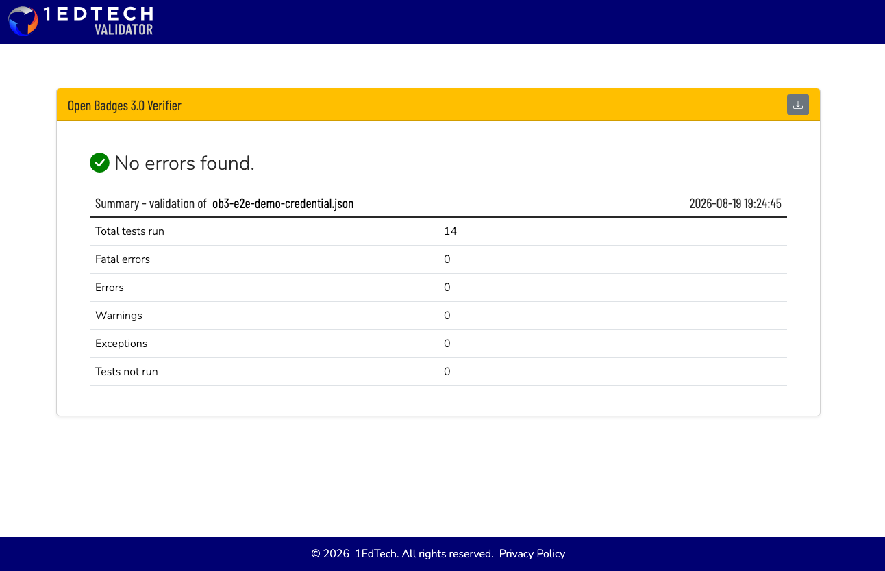

# OB 3.0 end-to-end external validation — report

Date: 2026-08-19
Scope: Task 8 (final rollout task) — validate a **real credential issued by
the full stack** (compose-built `api` image, on the `ob3-step-3`-merged
`master`, `8c0ce1f`) against the public
[vc.1ed.tech](https://vc.1ed.tech) Open Badges 3.0 Verifier, through a
disposable public tunnel, end to end: badge creation → instance award →
signed-credential GET → external validation.

## Verdict (one line)

**PASS — vc.1ed.tech: "No errors found."** 14 tests run, 0 fatal errors, 0
errors, 0 warnings, 0 exceptions, 0 tests not run, on a credential created
and served entirely by the running stack (not a hand-rolled spike script).
The inline `@context` workaround on `credentialSchema[0]` (added in rollout
step 3 to fix `1EdTechJsonSchemaValidator2019`'s missing term) is **accepted
without complaint** — no fallback to dropping `credentialSchema` was needed,
and **no corrections to badgekit-api were required.**



## Protocol, step by step

1. **Rebuild the api image** from the local `badgekit-api` checkout
   (`master`, `8c0ce1f` — all 3 OB3 rollout steps merged):
   `docker compose build api && docker compose up -d api`.

2. **`compose.yaml` change (this task):** added
   `PUBLIC_BASE_URL: ${PUBLIC_BASE_URL:-http://localhost:8080}` to the `api`
   service's environment — this is now mandatory whenever signing is
   configured (rollout step 3's critical fix: every URL baked into a signed
   document must come from an operator-controlled value, never the
   client-controlled `Host` header). Documented in `README.md`'s "OB 3.0 dev
   issuer key" section.

3. **Disposable public tunnel**, backgrounded, log to file:

   ```sh
   cloudflared tunnel --url http://localhost:8080
   ```

   Tunnel hostname: **`https://shell-wrote-petition-packed.trycloudflare.com`**
   (ephemeral, torn down at the end of this run — see "Cleanup" below).
   Verified reachable before doing anything else:
   `curl https://shell-wrote-petition-packed.trycloudflare.com/healthcheck` → `200`.

4. **Regenerated the issuer key** scoped to the tunnel host:

   ```sh
   ./gen-dev-key.sh 'did:web:shell-wrote-petition-packed.trycloudflare.com'
   ```

5. **Set `PUBLIC_BASE_URL`** to the tunnel's `https://` origin in `.env`
   (alongside the freshly written `ISSUER_DID`/`ISSUER_SIGNING_KEY`), **before
   the first credential GET** — per the critical-fix invariant, signing with
   the wrong `PUBLIC_BASE_URL` bakes it in permanently on first GET
   (lazy-sign-once + persist).

6. **Cleared stale credentials** — any `badgeInstances.credential` rows
   signed under a previous base URL/DID were truncated first, so nothing
   already-signed-and-persisted could be served with a mismatched URL:

   ```sh
   docker compose exec -T mysql mysql -ubadges -pbadges badgekit \
     -e "UPDATE badgeInstances SET credential = NULL"
   ```

7. **Restarted `api`** (`docker compose up -d api`) to pick up the new
   `.env`, then verified `did.json` resolves through the tunnel with the new
   key:

   ```
   $ curl -s https://shell-wrote-petition-packed.trycloudflare.com/.well-known/did.json
   {"@context":["https://www.w3.org/ns/did/v1","https://w3id.org/security/multikey/v1"],
    "id":"did:web:shell-wrote-petition-packed.trycloudflare.com",
    "verificationMethod":[{"id":"did:web:shell-wrote-petition-packed.trycloudflare.com#key-0",
    "type":"Multikey","controller":"did:web:shell-wrote-petition-packed.trycloudflare.com",
    "publicKeyMultibase":"z6Mkssdxs3VUppbTME1SuiaAF7LuS9jzMpQN45CgFGwyfpdH"}],
    "assertionMethod":["did:web:shell-wrote-petition-packed.trycloudflare.com#key-0"]}
   HTTP 200
   ```

8. **Issued a real badge + instance** via the signed-JWT API (the `seed.sh`
   pattern — a `master`-key JWT, no code changes needed), through the
   tunnel, against the pre-existing `wooclap` system:

   - `POST /systems/wooclap/badges` — a fresh badge, slug `ob3-e2e-demo`.
   - `POST /systems/wooclap/badges/ob3-e2e-demo/instances` — awarded to a
     throwaway test address (`ob3-e2e-demo-recipient@wooclap.com` — never
     appears in the credential itself, only its salted SHA-256 hash does).
   - Response: `{"status":"created","instance":{"slug":"800d4a6b6d9ff0db57e113e8a5b4ecb4d3d9910b", "credentialUrl":"http://shell-wrote-petition-packed.trycloudflare.com/public/credentials/800d4a6b6d9ff0db57e113e8a5b4ecb4d3d9910b", ...}}`

9. **GET the credential through the tunnel** (`https://` explicitly, since
   the 1.x `credentialUrl` field is `Host`-header-derived and echoed back
   `http://` — the signed credential's own `id` is `PUBLIC_BASE_URL`-derived
   and correctly `https://`, see the example below):

   ```
   $ curl -H "Accept: application/vc+ld+json" \
       https://shell-wrote-petition-packed.trycloudflare.com/public/credentials/800d4a6b6d9ff0db57e113e8a5b4ecb4d3d9910b
   HTTP/2 200, content-type: application/vc+ld+json
   ```

   A second GET returned **byte-identical** output — confirms lazy-sign-once
   + persist (no re-signing, no `proof.created` drift) is working end to end,
   not just in the unit tests.

10. **Submitted the credential to vc.1ed.tech** (Playwright, file-upload
    path — `Choose File` → `Upload`). Result: **"No errors found."** — see
    verdict above and screenshot.

## Review checklist (carried forward from earlier rollout reviews)

| # | Check | Result |
|---|-------|--------|
| 1 | The served status list's own `id` equals the instance credential's `credentialStatus.statusListCredential` URL (strict verifiers check this) | **PASS** — both are `https://shell-wrote-petition-packed.trycloudflare.com/public/credentials/status/0`, byte-identical strings. |
| 2 | `curl -H "Accept: application/vc+ld+json"` on both routes → 200 (the 406 fix) | **PASS** — instance credential route: `HTTP 200`; status list route: `HTTP 200`. |
| 3 | Does vc.1ed.tech accept the inline `@context` on `credentialSchema[0]` (workaround for the term missing from the official 3.0.3 context)? | **PASS, accepted as-is** — "No errors found", 0 errors/warnings/exceptions. No fallback needed (dropping `credentialSchema` entirely was the documented next step if this failed — not required). |

**Conclusion: no badgekit-api corrections were needed.** No `ob3-step-4-fixes`
branch was created — the code merged at `8c0ce1f` (all 3 rollout steps)
produced a credential the public validator accepted outright.

### Nice-to-have: status list credential at the validator

Also submitted the raw `BitstringStatusListCredential`
(`/public/credentials/status/0`) to the same `OB30Inspector` validator (via
its URI-input field, since it's not a file). **Outcome: the validator
rejected it** — `1 fatal error` ("type property does not contain one of
'VerifiableCredential' or 'BitstringStatusListCredential'" — a false
negative from the validator's own type-matching logic, since the document's
`type` array plainly contains both) and `1 error` ("missing required
@context uri .../context-3.0.3.json"). **This is expected and correct
behavior on badgekit-api's part, not a bug**: `OB30Inspector` is scoped to
validate `OpenBadgeCredential` documents specifically (it expects the OB 3.0
context and an OB3-shaped `type`), and the Bitstring Status List spec
explicitly does **not** require the OB 3.0 context on a status list
document — `app/lib/ob3.js`'s `buildStatusListCredential()` deliberately
omits it (see that function's own header comment, and
`global-constraints.md`'s fixed `@context` ordering, which only applies to
the `OpenBadgeCredential` itself). No action needed; this validator simply
isn't the right tool for this document type, and there's no evidence a
Bitstring-Status-List-aware verifier would reject it.

## Anonymized example credential

The actual served `OpenBadgeCredential` from this run (the recipient
identifier is already a salted hash in the real document — nothing here was
further redacted beyond that; the tunnel hostname is dead as of "Cleanup"
below):

```json
{
  "@context": [
    "https://www.w3.org/ns/credentials/v2",
    "https://purl.imsglobal.org/spec/ob/v3p0/context-3.0.3.json"
  ],
  "id": "https://shell-wrote-petition-packed.trycloudflare.com/public/credentials/800d4a6b6d9ff0db57e113e8a5b4ecb4d3d9910b",
  "type": ["VerifiableCredential", "OpenBadgeCredential"],
  "name": "OB3 End-to-End Demo Badge",
  "issuer": {
    "id": "did:web:shell-wrote-petition-packed.trycloudflare.com",
    "type": ["Profile"],
    "name": "Wooclap System",
    "url": "http://localhost:8080"
  },
  "validFrom": "2026-08-19T19:23:02Z",
  "awardedDate": "2026-08-19T19:23:02Z",
  "credentialSubject": {
    "type": ["AchievementSubject"],
    "identifier": [{
      "type": "IdentityObject",
      "hashed": true,
      "identityHash": "sha256$8b8917b9bd290e2e6725baa7447758cbb8add10d5811035d621c398d93373146",
      "identityType": "emailAddress",
      "salt": "083740613cdf6877"
    }],
    "achievement": {
      "id": "https://shell-wrote-petition-packed.trycloudflare.com/public/systems/wooclap/badges/ob3-e2e-demo",
      "type": ["Achievement"],
      "name": "OB3 End-to-End Demo Badge",
      "description": "Issued via the badgekit-api OB 3.0 signing pipeline, exercised against a disposable public tunnel for Open Badges 3.0 external validator testing.",
      "criteria": { "id": "https://shell-wrote-petition-packed.trycloudflare.com/criteria/ob3-e2e-demo" },
      "alignment": [],
      "image": { "id": "https://shell-wrote-petition-packed.trycloudflare.com/public/images/ob3-demo-badge.png", "type": "Image" }
    }
  },
  "credentialStatus": {
    "id": "https://shell-wrote-petition-packed.trycloudflare.com/public/credentials/status/0#2",
    "type": "BitstringStatusListEntry",
    "statusPurpose": "revocation",
    "statusListIndex": "2",
    "statusListCredential": "https://shell-wrote-petition-packed.trycloudflare.com/public/credentials/status/0"
  },
  "credentialSchema": [{
    "id": "https://purl.imsglobal.org/spec/ob/v3p0/schema/json/ob_v3p0_achievementcredential_schema.json",
    "type": "1EdTechJsonSchemaValidator2019",
    "@context": { "1EdTechJsonSchemaValidator2019": "https://purl.imsglobal.org/spec/ob/v3p0#1EdTechJsonSchemaValidator2019" }
  }],
  "proof": {
    "type": "DataIntegrityProof",
    "created": "2026-08-19T19:23:11Z",
    "verificationMethod": "did:web:shell-wrote-petition-packed.trycloudflare.com#key-0",
    "cryptosuite": "eddsa-rdfc-2022",
    "proofPurpose": "assertionMethod",
    "proofValue": "z52xBLsHiFVCtExWeZVYwYnoqmt6Zq5WxZHA5PEkP1fcZDcXu7B7MhV2fTdHQGnXKC7QHW9g59W4feBW62ivuYAbK"
  }
}
```

The raw file (identical to the above) and the status list credential used
for the nice-to-have check are also committed under
`docs/e2e-evidence/ob3-e2e-demo-credential.json` and
`docs/e2e-evidence/ob3-e2e-status-list-credential.json`.

One cosmetic observation (not a defect): `issuer.url` above is
`http://localhost:8080` — that's the `wooclap` system's own `url` field, set
once by `seed.sh` at system-creation time and unrelated to
`PUBLIC_BASE_URL`/signing (it's an ordinary badgekit 1.x data field, carried
through unchanged into the `issuer` object). It does not affect validity —
the validator raised zero errors/warnings about it — but a real deployment
should set the system's `url` to match its real public origin.

## Explicit note on domain policy

**This entire run used a throwaway `*.trycloudflare.com` tunnel domain.**
Per the project's global constraints, no real/production domain is used
anywhere in this stack. Real Open Badges 3.0 issuance (a stable `did:web`
pointed at a real, operator-controlled domain) **awaits the Q2 domain
decision** recorded as pending in `docs/ob3-migration-spec.md`. Nothing in
this report should be read as a production credential or a production
issuer identity — the tunnel, the key, and the signed credentials above were
all torn down/invalidated immediately after this validation run (see
"Cleanup").

## Cleanup

1. Killed the `cloudflared` tunnel process — the
   `shell-wrote-petition-packed.trycloudflare.com` hostname stopped
   resolving to this stack immediately after.
2. Restored the localhost dev key: `./gen-dev-key.sh` (no argument — defaults
   back to `did:web:localhost%3A8080`) and reset `PUBLIC_BASE_URL` back to
   `http://localhost:8080` in `.env`.
3. Cleared the tunnel-signed credentials from the DB (same `UPDATE
   badgeInstances SET credential = NULL` as step 6 above) — the two demo
   rows (`ob3-e2e-demo`) now re-sign on next GET under the restored
   localhost key/base URL instead of serving stale tunnel-hostname
   credentials.
4. Restarted `api` (`docker compose up -d api`) and re-verified
   `curl http://localhost:8080/.well-known/did.json` → `200` with the
   localhost key, and `curl http://localhost:8080/healthcheck` → `200`.
5. Left the stack running: `mysql`, `api`, `web`, `keycloak` all healthy.

## Files touched by this task

- `badgekit-stack/compose.yaml` — added `PUBLIC_BASE_URL` to the `api`
  service's environment (mandatory-for-signing critical fix from rollout
  step 3, now wired through the dev stack).
- `badgekit-stack/README.md` — "OB 3.0 dev issuer key" section expanded
  (`PUBLIC_BASE_URL` documented, tunnel override example), plus two new
  subsections: "Issuing a demo credential" (curl walkthrough, no `seed.sh`
  changes — see rationale below) and "External validation" (points at this
  report).
- `badgekit-stack/docs/ob3-validation-report.md` — this report.
- `badgekit-stack/docs/ob3-e2e-validator-verdict.png` — vc.1ed.tech verdict
  screenshot.
- `badgekit-stack/docs/e2e-evidence/ob3-e2e-demo-credential.json` /
  `ob3-e2e-status-list-credential.json` — the raw served credentials from
  this run.
- **badgekit-api: no changes.** The merged `8c0ce1f` passed external
  validation outright; no `ob3-step-4-fixes` branch was needed.

**Why a README walkthrough instead of extending `seed.sh`:** `seed.sh`'s
scope is specifically idempotent system bootstrapping (create-if-missing,
409 on repeat) that every stack bring-up needs once. Issuing a demo badge +
instance is a one-off, parameterized action (badge slug, recipient email)
that doesn't fit that idempotent-infra-setup shape — encoding it as a
copy-pasteable curl+JWT recipe in the README (mirroring `seed.sh`'s own
signing pattern) keeps `seed.sh` focused and makes the demo flow easy to
adapt without editing a script.
